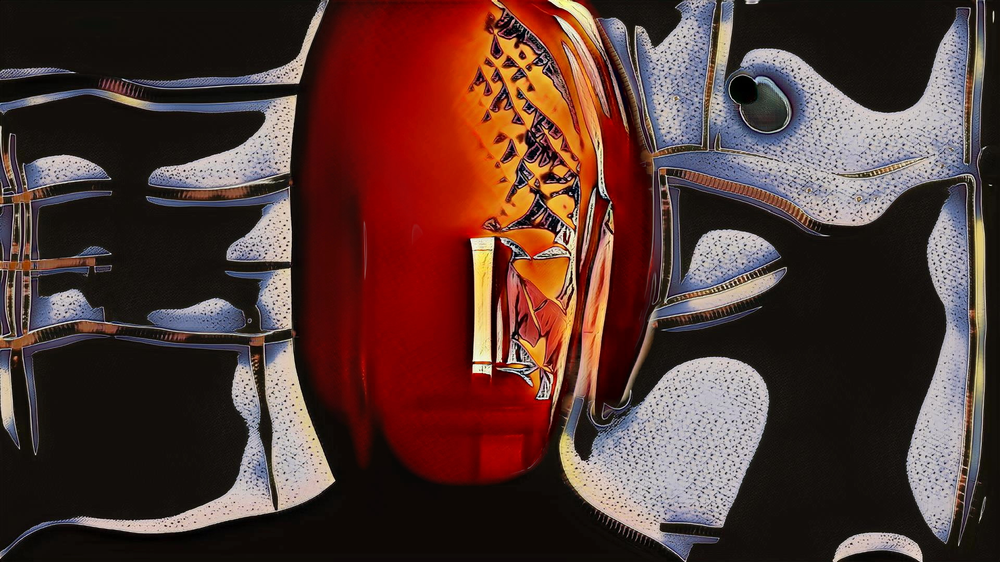

# StarGAN2 for practice

<p align='center'></p>

This version of [StarGAN2] (coined as 'Post-modern Style Transfer') is intended mostly for fellow artists, who rarely look at scientific metrics, but rather need a working creative tool. At least, this is what I use nearly daily myself.  
Here are few pieces, made with it: [Terminal Blink](https://vimeo.com/460679408), [Occurro](https://vimeo.com/527118906), [etc.](https://vimeo.com/445930853)  
Tested on Pytorch 1.4-1.8. Sequence-to-video conversions require [FFMPEG]. For more explicit details refer to the original implementation. 

## Features
* streamlined workflow, focused on practical tasks [TBA]
* cleaned up and simplified code for better readability
* stricter memory management to fit bigger batches on consumer GPUs
* models mixing (SWA) for better stability

**NB**: In the meantime here's only training code and some basic inference (processing). More various methods & use cases may be added later.

## Presumed file structure

| stargan2 | root
| :--- | :----------
| &boxvr;&nbsp; **_in** | input data for processing
| &boxvr;&nbsp; **_out** | generation output (sequences & videos)
| &boxvr;&nbsp; **data** | datasets for training
| &boxv;&nbsp; &boxur;&nbsp; afhq | [example] some dataset
| &boxv;&nbsp; &nbsp;&nbsp; &boxvr;&nbsp; cats | [example] images for training
| &boxv;&nbsp; &nbsp;&nbsp; &boxv;&nbsp; &boxur;&nbsp; test | [example] images for validation
| &boxv;&nbsp; &nbsp;&nbsp; &boxvr;&nbsp; dogs | [example] images for training
| &boxv;&nbsp; &nbsp;&nbsp; &boxv;&nbsp; &boxur;&nbsp; test | [example] images for validation
| &boxv;&nbsp; &nbsp;&nbsp; &boxur;&nbsp; &#x22ef; | 
| &boxvr;&nbsp; **models** | trained models for inference/processing
| &boxv;&nbsp; &boxur;&nbsp;  afhq-256-5-100.pkl | [example] trained model file
| &boxvr;&nbsp; **src** | source code
| &boxur;&nbsp; **train** | training folders
| &ensp;&ensp; &boxur;&nbsp;  afhq.. | [example] auto-created training folder


## Training

* Prepare your multi-domain dataset as shown above. Main directory should contain folders with images of different domains (e.g. cats, dogs, ..); every such folder must contain `test` subfolder with validation subset. Such structure allows easy data recombination for experiments. The images may be of any sizes (they'll be randomly cropped during training), but not smaller than `img_size` specified for training (default is `256`).  
* Train StarGAN2 on prepared dataset (e.g. `afhq`):
```
 python src/train.py --data_dir data/afhq --model_dir train/afhq --img_size 256 --batch 8
```
This will run training process, according to the settings in `src/train.py` (check and explore those!). Models are saved under `train/afhq` and named as `dataset-size-domaincount-kimgs`, e.g. `afhq-256-5-100.ckpt` (required for resuming). 

#### Few personal findings

1. Model parameters seriously oscillate during training (typical for Cycle- or Star- GANs), so it's better to save models frequently (there may be jewels). The best selected models can be mixed together with `swa.py` script for better stability. By default, Generator network is saved every 1000 iterations, and the full set - every 5000 iterations. 100k iterations (few days on a single GPU) may be enough; 200-250k would give pretty nice overfit.
2. Batch size is crucial for this network! Official settings are `batch=8` for size `256`, if you have large GPU RAM. One can fit batch 3 or 4 on 11gb GPU; those results are also interesting, but less impressive. Batches of 2 or 1 are for the brave only.. Size is better kept as `256`; the network has auto-scaling layer count, but I didn't manage to get comparable results for size `512` with batches up to 7 (max for 32gb).
3. Lambda coefficients `lambda_ds` (diversity), `lambda_cyc` (reconstruction) and `lambda_sty` (style) may be increased for smaller batches, especially if the goal is stylization, rather than photo-realistic transformation. The videos above, for instance, were made with these lambdas equal 3. The reference-based generation is nearly lost with such settings, but latent-based one can make nice art.
4. The order of domains in the training set matters a lot! I usually put some photos first (as it will be the main source imagery), and the closest to photoreal as second; but other approaches may go well too.

## Generation

* Transform image `test.jpg` with AFHQ model (can be downloaded [here](https://www.dropbox.com/s/etwm810v25h42sn/100000_nets_ema.ckpt?dl=0)):
```
python src/test.py --source test.jpg --model models/100000_nets_ema.ckpt
```
This will produce 3 images (one per trained domain in the model) in the `_out` directory.  
If `source` is a directory, every image in it will be processed accordingly. 

* Generate output only for the domain(s), referenced by number(s):
```
python src/test.py --source test.jpg --model models/100000_nets_ema.ckpt --ref 2
```

* Generate output with reference image for domain 1 (ref filename must start with that number):
```
python src/test.py --source test.jpg --model models/100000_nets_ema.ckpt --ref 1-ref.jpg
```

To be continued..


## Credits

StarGAN2:  
Copyright © 2020, NAVER Corp. All rights reserved.  
Made available under [Creative Commons BY-NC 4.0] license.  
Original paper: https://arxiv.org/abs/1912.01865  

[Creative Commons BY-NC 4.0]: <https://github.com/clovaai/stargan-v2/blob/master/LICENSE>
[StarGAN2]: <https://github.com/clovaai/stargan-v2>
[FFMPEG]: <https://ffmpeg.org/download.html>
